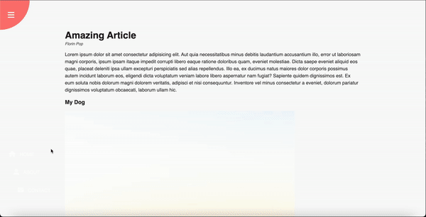

# Rotating_Navigation
This is a project that demonstrates a rotating navigation menu built with HTML, CSS, and JavaScript.

## Preview

## Features

- Rotating navigation menu
- Smooth animation effects
- Responsive design

## Technologies Used

- HTML
- CSS
- JavaScript

## Getting Started

To get a local copy of the project, you can follow these steps:

1. Clone the repository:
2. Navigate to the project directory:
3. Open the `index.html` file in your preferred web browser.

## License

This project is licensed under the [MIT License](LICENSE).

## Acknowledgement

The project is part of the "50 projects in 50 days - HTML, CSS & Javascript" course on Udemy by Brad Traversy.
